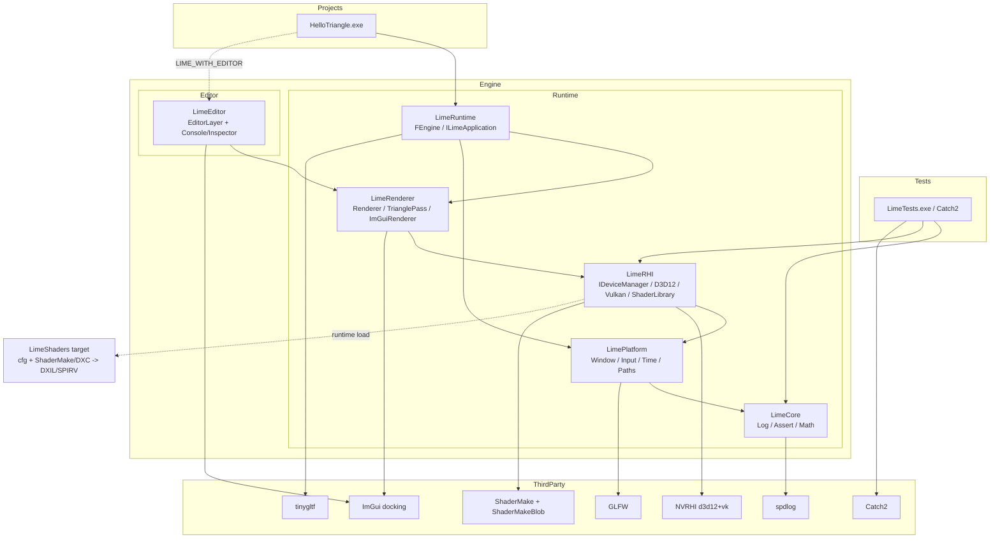

## 用户需求

从零搭建一个 Windows x64 渲染引擎的基础工程环境，技术组件为 NVRHI、GLFW、Dear ImGui（docking）、tinygltf、spdlog，并交付第一个可运行的验证目标。

## 产品概述

LimeEngine 是一个分层的 Windows 桌面渲染引擎工程骨架，同时支持 DX12 与 Vulkan 两个后端，引擎侧拆分为 Runtime 与 Editor，业务侧以独立项目形式接入。首个交付物 `HelloTriangle` 启动后显示一个持续旋转的彩色三角形，画面上叠加可停靠的编辑器界面：一个 Console 面板与一个 Inspector 面板。

## 核心功能

### 工程规范

- 采用 Unreal Engine 命名规范（`F`/`I`/`E`/`T` 类型前缀、PascalCase 成员与函数、布尔 `b` 前缀），由 `.clang-format` 与 `.clang-tidy` 强制约束；三方库目录豁免检查
- CMake 构建，全部三方库以 git submodule 置于 `ThirdParty/`；所有目录名首字母大写
- C++20；头文件与源文件同目录放置，不拆分 include/src
- 所有写入文件的注释使用英文并保持精简

### 引擎结构

- 分层：Platform / Core / RHI / Renderer / Engine，逐层单向依赖
- Runtime 与 Editor 物理拆分为独立模块，Editor 可通过开关关闭
- 引擎内置资产独立目录：`Engine/Shaders/`（着色器源码与编译配置）、`Engine/Content/`（内置纹理等）
- 业务项目位于 `Projects/`，单元测试位于 `Tests/`

### 跨后端着色器

- 一份 HLSL 源码，由 NVIDIA 官方工具 **ShaderMake** 驱动 DXC 分别产出 DXIL（DX12）与 SPIR-V（Vulkan），运行时按当前后端加载对应字节码
- 采用 ShaderMake 的 `.cfg` 清单（与 Donut 同格式）驱动批量编译，支持 `-T` 阶段、`-E` 入口、`-D` 宏及花括号排列组合展开，并自带增量编译与 include 依赖跟踪
- 运行时可切换 DX12 / Vulkan 后端，用于即时验证跨后端一致性

### HelloTriangle 表现效果

- 窗口内一个绕自身中心匀速旋转的三角形，顶点色插值渐变，深色背景
- 顶层为 ImGui 停靠布局，中央节点透传使三角形可见
- Console 面板：滚动显示引擎日志，带级别着色、文本过滤、自动滚动与清空
- Inspector 面板：可实时调节旋转速度、三角形颜色、背景色，并显示当前后端、帧率、分辨率
- 顶部菜单栏可切换面板显隐

### 单元测试

- Catch2 v3 接入 CTest，覆盖 Core 数学库、日志环形缓冲、着色器名组合等纯逻辑

## 技术调研结论（已确认，作为设计前提）

**NVRHI 不编译着色器**，只接收已编译的原生字节码：`createShader(ShaderDesc, const void* binary, size_t size)`，DX12 吃 DXIL、Vulkan 吃 SPIR-V。因此"一份源码支持两个后端"必须在**编译期**解决：用 DXC 对同一 HLSL 产出两套字节码。

**关键约束（Vulkan register shift）**：Vulkan 只有统一 descriptor binding 空间，NVRHI 用 `VulkanBindingOffsets` 把 HLSL 的 `t/s/b/u` 映射到不重叠区间（默认量级 SRV=0 / Sampler=128 / CBV=256 / UAV=384）。编译 SPIR-V 时必须传 `-fvk-t-shift/-fvk-s-shift/-fvk-b-shift/-fvk-u-shift` 与之**完全一致**，且创建 Vulkan 设备时传入同一组偏移，否则绑定错位。实现时需从 `ThirdParty/NVRHI/include/nvrhi/nvrhi.h` 读取实际默认值，并在 CMake 侧集中定义为单一真值来源。

**ShaderMake cfg 格式与输出命名**（已核对 `ShaderMake.cpp` 源码）：

- cfg 每行 `<相对路径.hlsl> -T <vs|ps|gs|hs|ds|cs|ms|as> [-E <入口>] [-D <MACRO>[={a,b,c}]] [-o <子目录>] [-s <后缀>] [-m X_Y] [-O n]`；支持 `//` 注释、`#ifdef/#if/#else/#endif`；`{}` 自动展开全部排列。源文件相对路径以 cfg 所在目录为基准。
- 输出名规则：`shaderName = <去扩展的相对路径>`，入口非 `main` 时追加 `_<Entry>`，再追加 `-s` 后缀；有宏时追加 `_<8位大写十六进制哈希>`（哈希取自**排序后**的 `MACRO=VALUE` 空格串，故书写顺序不影响结果）。扩展名默认 `.dxil` / `.spirv`。
- **Blob 规则（本项目运行时加载的依据）**：`--binaryBlob` 下 blob 文件名 = `outDir/shaderName + ext`（不含哈希）。若某 shader 只有一个排列且无任何宏，ShaderMake **跳过打包**，该文件即裸字节码。因此运行时判定：**无宏 → 裸字节码文件；有宏 → blob，用 `ShaderMake::FindPermutationInBlob` 取排列**。
- Blob 读取 API（`ShaderMake/ShaderBlob.h`，由静态库 `ShaderMakeBlob` 提供）：
`bool FindPermutationInBlob(const void* blob, size_t blobSize, const ShaderConstant* constants, uint32_t numConstants, const void** pBinary, size_t* pSize)`；`struct ShaderConstant { const char* name; const char* value; }`；失败时用 `FormatShaderNotFoundMessage(...)` 生成可读诊断。

**ShaderMake CMake 接口**（已核对其根 `CMakeLists.txt`）：target 为可执行 `ShaderMake` 与静态库 `ShaderMakeBlob`；导出 `SHADERMAKE_PATH`（非 TOOL 模式下其值就是 target 名 `ShaderMake`，可直接用于 `COMMAND` 并自动建立依赖）、`SHADERMAKE_DXC_PATH`、`SHADERMAKE_DXC_VK_PATH`（= `$ENV{VULKAN_SDK}/Bin/dxc`，两者互为 fallback）。选项默认值有坑，必须显式覆盖：`SHADERMAKE_FIND_DXC=OFF`（默认 ON 会在配置期从 GitHub 下载 DXC）、`SHADERMAKE_FIND_FXC=OFF`（默认 ON 且 `find_program(REQUIRED)`，本项目不需要 DXBC）、`SHADERMAKE_FIND_SLANG=OFF`、`SHADERMAKE_FIND_DXC_VK=ON`、`SHADERMAKE_TOOL=OFF`。其自身对 MSVC 施加 `/W4 /WX`，如新版 MSVC 报警需在父项目侧放宽。

**本机环境实测结论（已验证）**：

- CMake 4.4.2（`C:\Program Files\CMake\bin`）、Ninja 随 VS 2022 Professional 提供
- Vulkan SDK **1.4.357.0**（`C:\VulkanSDK\1.4.357.0`），其 `Bin\dxc.exe`（dxcompiler 1.9.0.5399）**实测可同时产出 DXIL 与 SPIR-V**（DXIL 2856B / SPIR-V 448B）；Windows SDK 自带的 dxc 报 `SPIR-V CodeGen not available`，不可用
- Windows SDK 仅 **10.0.20348.0**（低于 NVRHI README 要求的 10.0.22621.0），因此**必须**通过 `DirectX-Headers` submodule 补齐 DX12 Agility 头
- CMake 4.x 需 `CMAKE_POLICY_VERSION_MINIMUM=3.10` 才能配置声明了旧策略下限的三方库

## 技术栈

| 领域 | 选型 | 说明 |
| --- | --- | --- |
| 语言/标准 | C++20 | MSVC，`/permissive- /Zc:preprocessor /utf-8` |
| 构建 | CMake ≥ 3.24 + CMakePresets | Ninja Multi-Config（主，产出 compile_commands.json）+ VS 2022 生成器（调试） |
| RHI | NVRHI（`NVRHI_WITH_DX12=ON`、`NVRHI_WITH_VULKAN=ON`、DX11 关闭） | target：`nvrhi`、`nvrhi_d3d12`、`nvrhi_vk` |
| 窗口/输入 | GLFW 3.4 | 仅编译库本体，关掉 docs/tests/examples |
| UI | Dear ImGui `docking` 分支 | 核心源码 + `imgui_impl_glfw`（仅平台层），渲染层自研 NVRHI 后端 |
| 资产 | tinygltf | 自建 target，`TINYGLTF_IMPLEMENTATION` + 其自带 `stb_image.h` / `json.hpp` |
| 日志 | spdlog | 静态库模式，自定义环形缓冲 sink 供 Console 面板消费 |
| 测试 | Catch2 v3 | `catch_discover_tests` 接入 CTest |
| Shader 编译 | **ShaderMake**（NVIDIA-RTX/ShaderMake，submodule）+ Vulkan SDK 的 DXC | ShaderMake 负责 cfg 解析、排列展开、增量编译、include 依赖跟踪与 blob 打包；`ShaderMakeBlob` 静态库提供运行时排列查找 |
| 数学 | 自研 `Core/Math` | 不引入 glm：需求仅旋转/投影矩阵，且给 Catch2 提供有实际价值的被测对象 |


## 实现方案

### 整体策略

以「薄抽象 + 单向分层」为核心：Core（无图形依赖）→ Platform（GLFW）→ RHI（NVRHI 封装 + 设备管理）→ Renderer（Pass + ImGui 渲染后端）→ Engine（主循环与应用接口），Editor 作为可选侧挂模块消费 Renderer/Engine，Projects 只依赖 Engine 与可选 Editor。每层一个静态库 target，依赖关系由 CMake `target_link_libraries` 的 PUBLIC/PRIVATE 严格表达，防止跨层穿透。

### 关键技术决策

**1. DeviceManager 自研（必要）**
NVRHI 不提供设备/交换链管理（Donut 的 `DeviceManager` 才提供）。定义 `IDeviceManager` 抽象接口 + `FD3D12DeviceManager` / `FVulkanDeviceManager` 两个实现，统一暴露 `BeginFrame() / GetCurrentFramebuffer() / Present()`。

- DX12：D3D12 device + command queue + `IDXGISwapChain3`（从 GLFW `glfwGetWin32Window` 取 HWND），`nvrhi::d3d12::createDevice`
- Vulkan：instance/physical device/queues + `glfwCreateWindowSurface` + `VkSwapchainKHR` + acquire/present 信号量，`nvrhi::vulkan::createDevice`，并传入与着色器 shift 一致的 `VulkanBindingOffsets`
- Vulkan-Hpp 动态派发器：直接用 `VULKAN_HPP_DEFAULT_DISPATCHER.init(vkGetInstanceProcAddr)`（已链接 `Vulkan::Vulkan` 的导入库），避免不同头文件版本 `DynamicLoader` 命名空间差异
- Debug 构建包裹 `nvrhi::validation::createValidationLayer`，捕获 BindingSet/Layout 不匹配
- 后端由命令行 `--rhi=d3d12|vulkan` 或配置结构选择，工厂函数集中在 `DeviceManager.cpp`

**2. 用 ShaderMake 做 cfg 驱动的双目标编译**
`CMake/LimeShaderCompile.cmake` 提供 `lime_compile_shaders(CONFIG <cfg> OUTPUT_DIR <dir> INCLUDE_DIRS <dirs...>)`，为每个启用的后端各生成一次 ShaderMake 调用，聚合成 `LimeShaders` 自定义 target（`ALL`，由 ShaderMake 自身做增量判定，避免 CMake 侧重复实现依赖跟踪）：

- DXIL：`${SHADERMAKE_PATH} -p DXIL -c <cfg> -o <out>/DXIL --compiler ${SHADERMAKE_DXC_PATH} --shaderModel 6_5 --binaryBlob --matrixRowMajor --WX -I <includes>`
- SPIR-V：`-p SPIRV -o <out>/SPIRV` 并追加 `--vulkanMemoryLayout dx --vulkanVersion 1.3 --tRegShift/--sRegShift/--bRegShift/--uRegShift`，取值来自根 CMake 的 `LIME_VK_SHIFT_*` 单一真值源（必须与 `nvrhi::VulkanBindingOffsets` 一致）
- Debug 配置追加 `--embedPDB -O 0`，其余配置 `-O 3`；用 `$<CONFIG:Debug>` genex 表达
- **不加** `-fvk-invert-y`：NVRHI 的 Vulkan 后端内部已处理视口 Y 翻转，重复翻转会导致上下颠倒
- `--matrixRowMajor`（DXC `-Zpr`）与 C++ 侧 `FMatrix4x4` 的行主序存储对齐，避免 CPU 端转置
- 输出目录结构 `<Bin>/<Config>/Shaders/{DXIL,SPIRV}/<cfg 内相对路径>`，与 exe 同级，运行时按 exe 目录解析，无需注入编译期路径
- 输出命名规则完全交给 ShaderMake，C++ 侧不再镜像哈希逻辑；`FShaderLibrary` 只需拼 `shaderName`（含非 `main` 入口后缀），有宏时用 `ShaderMakeBlob` 的 `FindPermutationInBlob` 取排列
- 配置期校验 `SHADERMAKE_DXC_PATH` 非空，否则 `FATAL_ERROR` 提示安装 Vulkan SDK

**3. ImGui 渲染后端自研（不用 imgui_impl_dx12/vulkan）**
只复用 `imgui_impl_glfw` 处理输入/光标/剪贴板，绘制层实现 `FImGuiRenderer`：单一 HLSL（`ImGui.hlsl`，`MainVS`/`MainPS`）+ NVRHI pipeline，DX12 与 Vulkan 走**同一份代码**。这是本方案跨后端一致性的直接收益点，也与 Donut 的 `imgui_vertex/imgui_pixel` 做法一致。顶点/索引缓冲按需按 1.5 倍几何增长复用，避免每帧重建；纹理绑定用 `BindingSet` 缓存表按 `ImTextureID` 索引。

**4. Editor 与业务解耦**
`FEditorLayer` 持有面板列表（`IEditorPanel` 抽象）与 DockSpace 布局（首帧 `ImGui::DockBuilder` 建默认布局，之后交给 ini 持久化）。DockSpace 使用 `ImGuiDockNodeFlags_PassthruCentralNode`，让中央区域透出三角形——满足"先保持简单、不做 Viewport 面板"的要求且视觉自然。

- `FConsolePanel` 消费 Core 的 `FLogRingBuffer`（固定容量、互斥保护、覆盖式写入），Editor 不反向依赖 spdlog
- `FInspectorPanel` 通过 `SetDrawDelegate(std::function<void()>)` 由业务侧注入字段绘制，避免 Editor 依赖具体项目类型

**5. 主循环与应用接口**
`ILimeApplication` 定义 `OnInitialize/OnUpdate/OnRender/OnDrawEditorUI/OnShutdown`；`FEngine` 负责窗口、设备、渲染器、编辑器的生命周期与固定顺序帧调度：PollEvents → 计算 DeltaTime → App::OnUpdate → BeginFrame → Renderer 绘制 → Editor 绘制 → Present。业务侧只写一个继承类 + `Main.cpp` 三行启动。

### 性能与可靠性要点

- Framebuffer 按交换链索引预建缓存，避免每帧 `createFramebuffer`（NVRHI 对象创建有明显开销）
- Pipeline / BindingLayout 在初始化期一次性创建；三角形 MVP 走 `VolatileConstantBuffer`（DX12/Vulkan 上等价轻量常量路径）
- CommandList 复用同一实例，`open/close/executeCommandList` 成对，禁止每帧 new
- 日志：Console 面板只读环形缓冲快照，不在 UI 线程做字符串格式化；spdlog 级别过滤前置，Release 下 Trace/Debug 宏编译期剔除
- 窗口尺寸变化时统一走 `IDeviceManager::ResizeSwapChain()`（含 GPU idle 等待 + framebuffer 缓存失效），最小化为 0 时跳帧不渲染
- 三方库全部 `SYSTEM` 方式包含头文件，避免其警告污染 `/W4` 与 clang-tidy

### 技术债控制

- 唯一新增的自研基础设施是 DeviceManager（NVRHI 生态的必需缺口，按 Donut 成熟做法对齐）；Shader 编译改用 NVIDIA 官方 ShaderMake，不自造轮子
- 不提前引入 ECS / 材质系统 / 帧图，`Renderer` 保持"Pass 列表"最小形态，为后续扩展留接口但不做空壳抽象
- tinygltf 本阶段只完成 target 接入与实现 TU 编译验证，加载器留待后续，避免无实际用途的桩代码

## 架构设计



数据流（单帧）：GLFW 事件 → `FInput` 状态更新 → `FEngine` 计算 DeltaTime → 业务 `OnUpdate` 更新旋转角与参数 → `IDeviceManager::BeginFrame` 取当前 backbuffer framebuffer → `FRenderer` 清屏 + `FTrianglePass` 写入 volatile CB 并 draw → `FEditorLayer` 构建 ImGui DrawData → `FImGuiRenderer` 用 NVRHI 提交 → `Present`。

## 目录结构

### 结构概述

全新工程，共三大顶层代码域：`Engine`（Runtime + Editor + 内置资产）、`Projects`（业务示例）、`Tests`（单元测试），加上 `ThirdParty`（submodule）、`CMake`（构建脚本）、`Scripts`（辅助脚本）。所有 `.h` 与 `.cpp` 同目录并置。

```
LimeEngine/
├── CMakeLists.txt                  # [NEW] 根工程：project(LimeEngine CXX)、C++20、x64 与 Windows SDK 10.0.22621.0 校验、选项 LIME_BUILD_EDITOR/LIME_BUILD_TESTS/LIME_ENABLE_RHI_VULKAN、集中定义 Vulkan binding shift 变量、include CMake 模块、add_subdirectory 顺序 ThirdParty→Engine→Projects→Tests
├── CMakePresets.json               # [NEW] 预设：ninja-msvc-{debug,release,relwithdebinfo}（开 CMAKE_EXPORT_COMPILE_COMMANDS，clang-tidy 依赖）与 vs2022-x64（IDE 调试）；统一 build/ 输出目录
├── .clang-format                   # [NEW] UE 风格：Allman 大括号、UseTab ForIndentation、TabWidth/IndentWidth 4、ColumnLimit 140、PointerAlignment Left、AccessModifierOffset -4、NamespaceIndentation All、SortIncludes 分组（自身/三方/标准）
├── .clang-tidy                     # [NEW] 启用 readability-identifier-naming（ClassPrefix F、AbstractClassPrefix I、StructPrefix F、EnumPrefix E、成员与函数 CamelCase、常量 PascalCase）+ bugprone/performance/modernize 精选，关闭 use-trailing-return-type 等；HeaderFilterRegex 仅匹配 Engine|Projects|Tests
├── .gitignore                      # [NEW] 忽略 build/、.vs/、out/、*.user、编译产物与 imgui.ini
├── .gitmodules                     # [NEW] 记录全部 submodule 路径与分支（ImGui 固定 docking 分支，其余固定 release tag）
├── README.md                       # [NEW] 环境要求（VS2022、Windows SDK ≥10.0.22621.0、Vulkan SDK）、克隆与 submodule 初始化、构建运行命令、后端切换参数、代码规范说明、shader cfg 用法与路线图
├── CMake/
│   ├── LimeCompilerOptions.cmake   # [NEW] INTERFACE target LimeCompilerOptions：/W4 /MP /permissive- /Zc:preprocessor /utf-8 /EHsc，定义 NOMINMAX WIN32_LEAN_AND_MEAN UNICODE、LIME_DEBUG/LIME_RELEASE、按需 LIME_WITH_EDITOR/LIME_RHI_D3D12/LIME_RHI_VULKAN
│   ├── LimeTargetHelpers.cmake     # [NEW] lime_add_module(NAME SOURCES DEPS)：统一创建静态库、设置 FOLDER 分组、链接 LimeCompilerOptions、按目录树 source_group 便于 VS 浏览
│   └── LimeShaderCompile.cmake     # [NEW] 接入 ShaderMake：强制覆盖其选项（FIND_DXC=OFF 避免联网下载、FIND_FXC=OFF、FIND_SLANG=OFF、FIND_DXC_VK=ON、TOOL=OFF），校验 SHADERMAKE_DXC_PATH；提供 lime_compile_shaders()，为每个启用后端生成一次 ShaderMake 调用并聚合为 LimeShaders target；SPIR-V 的 reg shift 取自根 CMake 的 LIME_VK_SHIFT_* 单一真值源
├── Scripts/
│   ├── SetupSubmodules.ps1         # [NEW] git submodule update --init --recursive 一键初始化，含失败提示
│   ├── FormatCode.ps1              # [NEW] 递归对 Engine/Projects/Tests 的 .h/.cpp 执行 clang-format -i，跳过 ThirdParty
│   └── RunClangTidy.ps1            # [NEW] 基于 build/compile_commands.json 运行 clang-tidy，支持 -Fix 参数
├── ThirdParty/
│   ├── CMakeLists.txt              # [NEW] 三方库统一接入：GLFW 关 docs/tests/examples；NVRHI 开 DX12+Vulkan 关 DX11；创建 imgui 静态库（核心源码 + backends/imgui_impl_glfw.cpp + misc/cpp/imgui_stdlib.cpp，定义 IMGUI_DEFINE_MATH_OPERATORS）；创建 tinygltf 静态库（含 Adapters 实现 TU）；spdlog 静态库模式；Catch2 仅在 LIME_BUILD_TESTS 时加入；全部头文件以 SYSTEM 方式暴露以隔离警告
│   ├── .clang-format               # [NEW] DisableFormat: true，SortIncludes: Never，豁免三方代码
│   ├── .clang-tidy                 # [NEW] Checks: '-*'，豁免三方代码
│   ├── Adapters/
│   │   └── TinyGltfImpl.cpp        # [NEW] tinygltf 唯一实现 TU：定义 TINYGLTF_IMPLEMENTATION、STB_IMAGE_IMPLEMENTATION、STB_IMAGE_WRITE_IMPLEMENTATION 后包含 tiny_gltf.h，避免重复符号
│   ├── NVRHI/                      # [SUBMODULE] NVIDIA-RTX/NVRHI
│   ├── GLFW/                       # [SUBMODULE] glfw/glfw（tag 3.4）
│   ├── ImGui/                      # [SUBMODULE] ocornut/imgui（branch docking）
│   ├── TinyGLTF/                   # [SUBMODULE] syoyo/tinygltf
│   ├── SpdLog/                     # [SUBMODULE] gabime/spdlog（v1.x）
│   ├── Catch2/                     # [SUBMODULE] catchorg/Catch2（v3.x）
│   ├── ShaderMake/                 # [SUBMODULE] NVIDIA-RTX/ShaderMake，提供 ShaderMake 可执行与 ShaderMakeBlob 静态库
│   ├── VulkanHeaders/              # [SUBMODULE] KhronosGroup/Vulkan-Headers，提供 NVRHI 所需 Vulkan-Headers target（替代 NVRHI_FETCH_VULKAN_HEADERS）
│   └── DirectXHeaders/             # [SUBMODULE] microsoft/DirectX-Headers，提供 DirectX-Headers target（本机 Windows SDK 仅 10.0.20348.0，必需）
├── Engine/
│   ├── CMakeLists.txt              # [NEW] 声明引擎 shader 输出目录 LIME_SHADER_OUTPUT_DIR，调用 lime_compile_shaders 生成 LimeShaders target，递归加入 Runtime 各模块与 Editor（受 LIME_BUILD_EDITOR 控制），定义 LIME_ENGINE_CONTENT_DIR/LIME_ENGINE_SHADER_DIR 供开发期直接读源目录
│   ├── Shaders/
│   │   ├── LimeShaders.cfg         # [NEW] ShaderMake 清单，首批四条：Triangle/Triangle.hlsl 的 vs/ps、ImGui/ImGui.hlsl 的 vs/ps；顶部英文注释说明字段与 {} 排列语法
│   │   ├── Include/
│   │   │   └── Common.hlsli        # [NEW] 共享定义：常量缓冲布局约定、寄存器语义注释（与 NVRHI VulkanBindingOffsets 对应）、通用小工具函数
│   │   ├── Triangle/
│   │   │   └── Triangle.hlsl       # [NEW] MainVS/MainPS：b0 常量缓冲含 MVP 与 Tint，顶点属性语义 POSITION/COLOR，输出顶点色插值
│   │   └── ImGui/
│   │       └── ImGui.hlsl          # [NEW] MainVS/MainPS：b0 正交投影矩阵，t0 字体/纹理 SRV + s0 采样器，POSITION/TEXCOORD/COLOR 语义，与 ImDrawVert 布局严格对齐
│   ├── Content/
│   │   ├── README.md               # [NEW] 内置资产目录用途与命名约定说明
│   │   └── Textures/.gitkeep       # [NEW] 内置纹理目录占位；本阶段默认白图/棋盘图由代码程序化生成，后续放入实际纹理文件
│   └── Source/
│       ├── Runtime/
│       │   ├── Core/
│       │   │   ├── CMakeLists.txt          # [NEW] lime_add_module(LimeCore ... DEPS spdlog)，无任何图形依赖
│       │   │   ├── CoreMinimal.h           # [NEW] 汇总常用头（基础类型别名、断言、日志宏），供上层单点包含
│       │   │   ├── CoreTypes.h             # [NEW] 固定宽度整型别名（int32/uint32/...）、LIME_API 与 force-inline 宏、编译期平台宏
│       │   │   ├── LimeAssert.h/.cpp       # [NEW] LIME_CHECK/LIME_VERIFY/LIME_ENSURE：失败时输出文件行号与消息并触发 __debugbreak，Release 下 CHECK 编译期剔除
│       │   │   ├── Logging/
│       │   │   │   ├── LogManager.h/.cpp   # [NEW] 封装 spdlog：初始化控制台+文件+环形缓冲三 sink，声明日志分类（LogCore/LogRHI/LogRenderer/LogEditor），提供 LIME_LOG(Category, Level, Fmt, ...) 宏并在 Release 剔除低级别
│       │   │   └── LogRingBuffer.h/.cpp    # [NEW] 固定容量线程安全环形缓冲 + 自定义 spdlog sink，条目含时间戳/级别/分类/消息；提供快照读取接口供 Console 面板消费，避免 UI 侧持锁遍历
│       │   │   └── Math/
│       │   │       ├── MathUtils.h         # [NEW] 常量 Pi、角度弧度转换、Clamp/Lerp 等 constexpr 工具
│       │   │       ├── Vector.h/.cpp       # [NEW] FVector2/FVector3/FVector4：运算符重载、点叉积、归一化、长度
│       │   │       └── Matrix.h/.cpp       # [NEW] FMatrix4x4（行主序、列向量约定明确注释）：Identity、Multiply、RotationX/Y/Z、Scale、Translation、PerspectiveFovLH、LookAtLH、Transpose，为跨后端剪裁空间差异留统一入口
│       │   ├── Platform/
│       │   │   ├── CMakeLists.txt          # [NEW] lime_add_module(LimePlatform ... DEPS LimeCore glfw)
│       │   │   ├── Window.h/.cpp           # [NEW] FWindow 封装 GLFW：FWindowDesc 描述创建参数，暴露 PollEvents/ShouldClose/GetSize/GetNativeHandle(HWND)/GetGlfwHandle，注册 resize/close/key 回调转发；GLFW_NO_API 客户端 API（NVRHI 自管上下文）
│       │   │   ├── Input.h/.cpp            # [NEW] FInput 键鼠状态查询（按下/按住/释放、鼠标位置与滚轮），由窗口回调驱动，双缓冲上帧状态
│       │   │   ├── PlatformTime.h/.cpp     # [NEW] FTimer 高精度计时与帧间 DeltaTime、平滑 FPS 统计
│       │   │   └── PlatformPaths.h/.cpp    # [NEW] 可执行文件目录、引擎 Shader/Content 目录解析（优先编译期注入的开发路径，回退到 exe 相对路径），路径拼接工具
│       │   ├── RHI/
│       │   │   ├── CMakeLists.txt          # [NEW] lime_add_module(LimeRHI ... DEPS LimePlatform nvrhi nvrhi_d3d12 nvrhi_vk ShaderMakeBlob d3d12 dxgi dxguid)，add_dependencies(LimeRHI LimeShaders)
│       │   │   ├── RHITypes.h              # [NEW] ERHIBackend 枚举、FDeviceCreationDesc（后端/校验层开关/vsync/backbuffer 数量）、后端名互转与命令行解析辅助
│       │   │   ├── DeviceManager.h/.cpp    # [NEW] IDeviceManager 抽象（Initialize/Shutdown/BeginFrame/Present/ResizeSwapChain/GetDevice/GetCurrentFramebuffer/GetBackBufferFormat）+ CreateDeviceManager 工厂；Debug 下套 nvrhi::validation 层；framebuffer 按交换链索引缓存与失效逻辑放在公共基类
│       │   │   ├── D3D12/
│       │   │   │   └── D3D12DeviceManager.h/.cpp  # [NEW] FD3D12DeviceManager：DXGI 适配器枚举与选择、D3D12 device + debug layer、graphics queue、从 HWND 创建 IDXGISwapChain3（FLIP_DISCARD）、nvrhi::d3d12::createDevice、fence 帧同步、Resize 重建
│       │   │   ├── Vulkan/
│       │   │   │   └── VulkanDeviceManager.h/.cpp # [NEW] FVulkanDeviceManager：VULKAN_HPP_DEFAULT_DISPATCHER.init(vkGetInstanceProcAddr)、instance（GLFW 所需扩展 + 校验层）、物理设备与队列族选择、glfwCreateWindowSurface、VkSwapchainKHR 与 image view、acquire/present 信号量、nvrhi::vulkan::createDevice 并传入与 shader shift 一致的 VulkanBindingOffsets
│       │   │   ├── ShaderKey.h/.cpp        # [NEW] FShaderKey（相对路径/入口/宏列表）与纯函数 MakeShaderMakeOutputName()：镜像 ShaderMake 的 shaderName 规则（入口非 main 时追加 _<Entry>），以及后端→子目录/扩展名映射；可脱离设备单测
│       │   │   └── ShaderLibrary.h/.cpp    # [NEW] FShaderLibrary：按后端选 DXIL/SPIRV 子目录读取 ShaderMake 产物；无宏时按裸字节码创建，有宏时经 ShaderMake::FindPermutationInBlob 取排列（失败用 FormatShaderNotFoundMessage 输出诊断）；按 key 缓存 ShaderHandle 与文件内容复用
│       │   ├── Renderer/
│       │   │   ├── CMakeLists.txt          # [NEW] lime_add_module(LimeRenderer ... DEPS LimeRHI imgui)
│       │   │   ├── Renderer.h/.cpp         # [NEW] FRenderer：持有 IDeviceManager 引用与复用的 CommandList，负责清屏（可配背景色）、按序执行 Pass、驱动 ImGui 渲染；暴露 BeginFrame/EndFrame 与 Pass 注册
│       │   │   ├── RenderTypes.h           # [NEW] FFrameContext（DeltaTime/视口尺寸/当前 framebuffer）、顶点结构 FSimpleVertex 定义
│       │   │   ├── Passes/
│       │   │   │   └── TrianglePass.h/.cpp # [NEW] FTrianglePass：初始化期建顶点缓冲、BindingLayout(b0 VolatileConstantBuffer)、GraphicsPipeline 与 InputLayout（传 VS 句柄，语义名匹配 HLSL）；每帧写 MVP+Tint 并 draw；对外暴露旋转角与颜色参数
│       │   │   └── ImGui/
│       │   │       └── ImGuiRenderer.h/.cpp # [NEW] FImGuiRenderer：加载 ImGui.hlsl 字节码建 pipeline，字体图集上传为 nvrhi Texture，按需几何增长的顶点/索引缓冲，按 ImTextureID 缓存 BindingSet，遍历 ImDrawData 设置 scissor 与 drawIndexed；DX12/Vulkan 共用同一实现
│       │   └── Engine/
│       │       ├── CMakeLists.txt          # [NEW] lime_add_module(LimeRuntime ... DEPS LimeRenderer tinygltf)；LIME_BUILD_EDITOR 时 PUBLIC 链接 LimeEditor 并定义 LIME_WITH_EDITOR
│       │       ├── EngineConfig.h          # [NEW] FEngineConfig：窗口标题与尺寸、后端选择、是否启用编辑器与校验层、vsync；提供命令行解析入口
│       │       ├── ApplicationInterface.h  # [NEW] ILimeApplication 抽象：OnInitialize/OnUpdate/OnRender/OnDrawEditorUI/OnShutdown，业务侧唯一需要实现的接口
│       │       └── Engine.h/.cpp           # [NEW] FEngine：按序初始化日志→窗口→设备→渲染器→编辑器→应用，主循环固定顺序调度与 DeltaTime 计算，窗口 resize/最小化处理，逆序安全关闭；异常与初始化失败路径统一记录日志并返回错误码
│       └── Editor/
│           ├── CMakeLists.txt              # [NEW] lime_add_module(LimeEditor ... DEPS LimeRenderer imgui)，仅在 LIME_BUILD_EDITOR 时加入
│           ├── EditorContext.h             # [NEW] FEditorContext：传给面板的只读上下文（DeltaTime/FPS/后端名/分辨率/日志缓冲引用），避免面板直接依赖引擎内部对象
│           ├── EditorLayer.h/.cpp          # [NEW] FEditorLayer：ImGui 上下文与 docking/ini 配置初始化、ImGui_ImplGlfw_InitForOther 接入、深色主题与字体设置、全屏 DockSpace（PassthruCentralNode 让三角形透出）、首帧 DockBuilder 默认布局（Console 底部、Inspector 右侧）、菜单栏与面板集合调度、关闭时清理
│           └── Panels/
│               ├── EditorPanel.h           # [NEW] IEditorPanel 抽象：GetName/IsVisible/SetVisible/OnDrawUI(FEditorContext)
│               ├── ConsolePanel.h/.cpp     # [NEW] FConsolePanel：读取日志环形缓冲快照，按级别着色、级别复选过滤、文本搜索、自动滚动、清空按钮；使用 ImGuiListClipper 保证大量日志下的滚动性能
│               └── InspectorPanel.h/.cpp   # [NEW] FInspectorPanel：上部显示只读运行信息（后端/FPS/分辨率/DeltaTime），下部执行业务注入的 DrawDelegate 绘制可调参数，Editor 不依赖具体项目类型
├── Projects/
│   ├── CMakeLists.txt                      # [NEW] 遍历加入业务项目子目录
│   └── HelloTriangle/
│       ├── CMakeLists.txt                  # [NEW] add_executable(HelloTriangle WIN32 关闭以保留控制台)，链接 LimeRuntime，设为 VS 启动项目并设置调试工作目录，依赖 LimeShaders
│       └── Source/
│           ├── Main.cpp                    # [NEW] 解析命令行为 FEngineConfig（含 --rhi=d3d12|vulkan），构造 FHelloTriangleApp，FEngine::Run，返回错误码
│           └── HelloTriangleApp.h/.cpp     # [NEW] FHelloTriangleApp 实现 ILimeApplication：持有 FTriangleSettings（旋转速度/暂停/三角形颜色/背景色/FOV），OnUpdate 按 DeltaTime 累加旋转角，OnRender 更新 TrianglePass 参数，OnDrawEditorUI 用 ImGui 控件绘制这些参数并注入 Inspector；启动与后端信息打日志以便 Console 面板可见
└── Tests/
    ├── CMakeLists.txt                      # [NEW] add_executable(LimeTests)，链接 Catch2::Catch2WithMain 与 LimeCore/LimeRHI，include(Catch) + catch_discover_tests 接入 CTest
    ├── Core/
    │   ├── MathTests.cpp                   # [NEW] 覆盖矩阵单位元/结合律、RotationZ 对已知向量的旋转结果、Perspective 关键项、向量点叉积与归一化边界（零向量）
    │   └── LoggingTests.cpp                # [NEW] 覆盖环形缓冲容量上限、满后覆盖顺序、快照内容与级别过滤正确性
    └── RHI/
        └── ShaderKeyTests.cpp              # [NEW] 覆盖 MakeShaderMakeOutputName 在 main/非 main 入口、嵌套相对路径下的输出，以及后端→子目录/扩展名映射，锁定与 ShaderMake 命名规则的一致性契约
```

## 关键接口定义

```cpp
// Engine/Source/Runtime/Engine/ApplicationInterface.h
class ILimeApplication
{
public:
    virtual ~ILimeApplication() = default;
    virtual bool OnInitialize(class FEngine& Engine) = 0;
    virtual void OnUpdate(float DeltaSeconds) = 0;
    virtual void OnRender(class FRenderer& Renderer) = 0;
    virtual void OnDrawEditorUI() {}
    virtual void OnShutdown() {}
};

// Engine/Source/Runtime/RHI/DeviceManager.h
class IDeviceManager
{
public:
    virtual ~IDeviceManager() = default;
    virtual bool Initialize(class FWindow& Window, const FDeviceCreationDesc& Desc) = 0;
    virtual void Shutdown() = 0;
    virtual bool BeginFrame() = 0;
    virtual void Present() = 0;
    virtual void ResizeSwapChain(uint32 Width, uint32 Height) = 0;
    virtual nvrhi::IDevice* GetDevice() const = 0;
    virtual nvrhi::IFramebuffer* GetCurrentFramebuffer() const = 0;
    virtual ERHIBackend GetBackend() const = 0;
};

std::unique_ptr<IDeviceManager> CreateDeviceManager(ERHIBackend Backend);
```