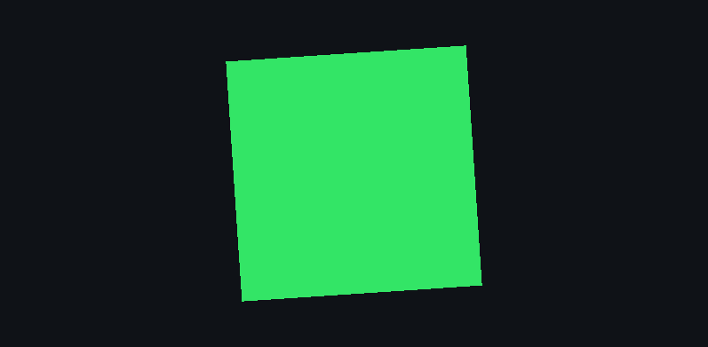

# 自定义 Pass

Pass 是渲染工作的单位。本文写一个带可调参数的四边形 Pass，涵盖 Shader 编写、资源创建、反射声明。

## 三个文件

一个典型的 Pass 由三个文件组成，职责分开是有原因的：

```
Source/QuadSettings.h    可调参数 + 反射声明
Source/QuadPass.h        类声明
Source/QuadPass.cpp      实现 + 注册宏
Shaders/Quad/Quad.hlsl   Shader
```

设置结构单独一个头文件，是因为面板可能要引用它，而面板不应该被迫包含整个 Pass 的 nvrhi 依赖。

## 第一步：设置结构与反射

```cpp
// Source/QuadSettings.h
#pragma once

#include "Core/Math/Vector.h"
#include "Core/Reflection/Reflection.h"

namespace MyGame
{
	struct FQuadSettings
	{
		bool bVisible = true;
		float Scale = 1.0f;
		float RotationSpeed = 0.5f;
		Lime::FVector4 Color{ 0.9f, 0.4f, 0.2f, 1.0f };
	};
} // namespace MyGame

// 必须在全局作用域，类型名要带命名空间
LIME_REFLECT(MyGame::FQuadSettings)
{
	LIME_PROPERTY(bVisible, Lime::FProp("Visible"));
	LIME_PROPERTY(Scale, Lime::FProp("Scale").Range(0.1f, 3.0f).Tooltip("单位倍数"));
	LIME_PROPERTY(RotationSpeed, Lime::FProp("Speed").Range(-6.0f, 6.0f));
	LIME_PROPERTY(Color, Lime::FProp("Color").AsColor());
}
```

**这段声明一次，换来两件事**：

1. Inspector 面板自动生成控件（滑条、颜色选择器、复选框）
2. 自动化脚本能按字段名读写（`pass.set`）

不需要为这两件事分别写代码 —— 这是反射在这个引擎里的核心价值。

### FProp 可用的修饰

| 方法 | 效果 |
| --- | --- |
| `FProp("显示名")` | 构造，参数是 Inspector 里显示的标签 |
| `.Range(min, max)` | 限定范围，并自动切换为滑条 |
| `.AsColor()` | `FVector4` 用颜色选择器 |
| `.AsDrag(min, max)` | 用拖动控件而非滑条 |
| `.Tooltip("说明")` | 悬停提示 |
| `.ReadOnly()` | 只读，Inspector 灰显，自动化写入会被拒绝 |
| `.Transient()` | 不参与存盘，用于累积角度这类运行时状态 |

> 显示名和 Tooltip **必须是字符串字面量**。EnTT 只存指针不拷贝内容，传临时字符串会变成悬垂指针。

支持的字段类型：`bool`、`float`、`int32`、`uint32`、`FVector2`、`FVector3`、`FVector4`。

## 第二步：Shader

```hlsl
// Shaders/Quad/Quad.hlsl
#include "Common.hlsli"

cbuffer FQuadConstants : register(b0)
{
	// row_major 对应 CPU 侧行主序的 FMatrix4x4。
	// DXC 会把 HLSL 的 row_major 映射到 SPIR-V 的 ColMajor 装饰 —— 两边术语相反但内存布局一致，
	// 所以两个后端都不需要在 CPU 侧转置。
	row_major float4x4 WorldViewProjection;
	float4 Color;
};

struct FVertexInput
{
	float3 Position : POSITION;
	float4 Color : COLOR;
};

struct FVertexOutput
{
	float4 Position : SV_Position;
	float4 Color : COLOR;
};

FVertexOutput MainVS(FVertexInput Input)
{
	FVertexOutput Output;
	Output.Position = mul(WorldViewProjection, float4(Input.Position, 1.0f));
	Output.Color = Input.Color * Color;
	return Output;
}

float4 MainPS(FVertexOutput Input) : SV_Target0
{
	return Input.Color;
}
```

一份 HLSL 同时供 D3D12 和 Vulkan 使用。三条约定：

- **常量缓冲矩阵要显式写 `row_major`**，不要依赖全局打包标志 —— DXC 的 SPIR-V 后端会忽略 `-Zpr`
- **不要加 `-fvk-invert-y`**，NVRHI 已经翻转了 Vulkan 视口
- **register 编号照常写**，Vulkan 的 binding 偏移由 CMake 和 `MakeBindingLayoutDesc` 一起处理，见下文

### 注册到 ShaderMake

`Shaders/MyGameShaders.cfg`，一行一个编译目标：

```
// 语法：<相对本文件的路径> -T <vs|ps|cs|...> [-E <入口>] [-D <宏>[={a,b,c}]]

Quad/Quad.hlsl -T vs -E MainVS
Quad/Quad.hlsl -T ps -E MainPS
```

每一行会被编译两次，分别输出到 `Shaders/<项目名>/DXIL/` 和 `Shaders/<项目名>/SPIRV/`。ShaderMake 负责宏排列组合展开、include 依赖跟踪、增量构建。

引擎的 `Shaders/Include` 在包含路径上，所以可以 `#include "Common.hlsli"`。

## 第三步：类声明

```cpp
// Source/QuadPass.h
#pragma once

#include "Renderer/RenderTypes.h"

#include "QuadSettings.h"

namespace MyGame
{
	class FQuadPass final : public Lime::TRenderPass<FQuadPass>
	{
	public:
		// 同时决定绘制顺序和所属渲染阶段
		static constexpr Lime::ERenderPassPriority Priority = Lime::ERenderPassPriority::Scene;

		const char* GetName() const override { return "Quad"; }

		bool Initialize(Lime::FRenderer& Renderer) override;
		void Shutdown() override;
		void OnBeginFrame(Lime::FRenderer& Renderer, const Lime::FFrameContext& Context) override;
		void Render(const Lime::FFrameContext& Context) override;
		void OnFramebufferChanged(nvrhi::IFramebuffer* Framebuffer) override;

		// 让 Inspector 能生成控件；不重写这个函数，Pass 就不出现在 Inspector 里
		Lime::FReflectedRef GetReflectedSettings() override { return Lime::MakeReflectedRef(Settings); }

		FQuadSettings& GetSettings() { return Settings; }
		float GetRotationRadians() const { return RotationRadians; }

	private:
		bool CreatePipeline(nvrhi::IFramebuffer* Framebuffer);

		nvrhi::IDevice* Device = nullptr;
		nvrhi::ShaderHandle VertexShader;
		nvrhi::ShaderHandle PixelShader;
		nvrhi::InputLayoutHandle InputLayout;
		nvrhi::BufferHandle VertexBuffer;
		nvrhi::BufferHandle IndexBuffer;
		nvrhi::BufferHandle ConstantBuffer;
		nvrhi::BindingLayoutHandle BindingLayout;
		nvrhi::BindingSetHandle BindingSet;
		nvrhi::GraphicsPipelineHandle Pipeline;

		FQuadSettings Settings;
		float RotationRadians = 0.0f;
	};
} // namespace MyGame
```

继承 `TRenderPass<自己>` 而不是直接继承 `IRenderPass`：CRTP 基类自动提供类型标识（用于 `FindPass<T>()`）和 `GetPriority()`。

### 优先级与渲染阶段

`Priority` 同时决定两件事 —— 绘制顺序，以及 Pass 属于哪个渲染阶段：

| 优先级 | 数值 | 阶段 | 有编辑器时的目标 | 无编辑器时 |
| --- | --- | --- | --- | --- |
| `Background` | -1000 | 场景 | 视口离屏纹理 | 交换链 |
| `Scene` | 0 | 场景 | 视口离屏纹理 | 交换链 |
| `PostProcess` | 1000 | 场景 | 视口离屏纹理 | 交换链 |
| `Overlay` | 2000 | 场景 | 视口离屏纹理 | 交换链 |
| `EditorUI` | 3000 | 编辑器 UI | 交换链 | 交换链 |

分界线在 `EditorUI`。世界空间的 UI（gizmo、场景内标签）属于场景阶段，所以这个枚举叫 `EditorUI` 而不是 `UI`。

项目 Pass 一般用 `Scene`。相同优先级按注册顺序排列。

## 第四步：实现

### Initialize：创建资源

```cpp
// Source/QuadPass.cpp
#include "QuadPass.h"

#include "Core/Logging/LogManager.h"
#include "Core/Math/Matrix.h"
#include "Renderer/RenderPassRegistry.h"
#include "Renderer/Renderer.h"

#include <nvrhi/utils.h>

#include <array>

namespace MyGame
{
	using namespace Lime;

	namespace
	{
		// 必须与 Quad.hlsl 里的 FQuadConstants 一致
		struct FQuadConstants
		{
			FMatrix4x4 WorldViewProjection;
			FVector4 Color;
		};

		constexpr std::array<FSimpleVertex, 4> QuadVertices = { {
			{ { -0.5f, -0.5f, 0.0f }, { 1.0f, 1.0f, 1.0f, 1.0f } },
			{ { 0.5f, -0.5f, 0.0f }, { 1.0f, 1.0f, 1.0f, 1.0f } },
			{ { 0.5f, 0.5f, 0.0f }, { 1.0f, 1.0f, 1.0f, 1.0f } },
			{ { -0.5f, 0.5f, 0.0f }, { 1.0f, 1.0f, 1.0f, 1.0f } },
		} };

		constexpr std::array<uint16, 6> QuadIndices = { 0, 1, 2, 0, 2, 3 };
	} // namespace

	bool FQuadPass::Initialize(FRenderer& InRenderer)
	{
		Device = InRenderer.GetDevice();
		if (Device == nullptr)
		{
			return false;
		}

		// 从项目 Shader 根目录解析，引擎已自动注册该路径
		FShaderLibrary& Shaders = InRenderer.GetShaderLibrary();
		VertexShader = Shaders.GetShader("Quad/Quad.hlsl", "MainVS", nvrhi::ShaderType::Vertex);
		PixelShader = Shaders.GetShader("Quad/Quad.hlsl", "MainPS", nvrhi::ShaderType::Pixel);
		if (VertexShader == nullptr || PixelShader == nullptr)
		{
			return false;
		}

		// 语义名要与 HLSL 声明一致；传入 VS 句柄可让 D3D 校验布局
		const std::array<nvrhi::VertexAttributeDesc, 2> Attributes = { {
			nvrhi::VertexAttributeDesc()
				.setName("POSITION")
				.setFormat(nvrhi::Format::RGB32_FLOAT)
				.setOffset(offsetof(FSimpleVertex, Position))
				.setElementStride(sizeof(FSimpleVertex)),
			nvrhi::VertexAttributeDesc()
				.setName("COLOR")
				.setFormat(nvrhi::Format::RGBA32_FLOAT)
				.setOffset(offsetof(FSimpleVertex, Color))
				.setElementStride(sizeof(FSimpleVertex)),
		} };

		InputLayout = Device->createInputLayout(Attributes.data(), static_cast<uint32_t>(Attributes.size()), VertexShader);
		if (InputLayout == nullptr)
		{
			LIME_LOG_ERROR(LIME_LOG_CATEGORY_APP, "createInputLayout failed for the quad pass");
			return false;
		}

		const nvrhi::BufferDesc VertexBufferDesc = nvrhi::BufferDesc()
													   .setByteSize(sizeof(QuadVertices))
													   .setIsVertexBuffer(true)
													   .setInitialState(nvrhi::ResourceStates::VertexBuffer)
													   .setKeepInitialState(true)
													   .setDebugName("QuadVertices");
		VertexBuffer = Device->createBuffer(VertexBufferDesc);

		const nvrhi::BufferDesc IndexBufferDesc = nvrhi::BufferDesc()
													  .setByteSize(sizeof(QuadIndices))
													  .setIsIndexBuffer(true)
													  .setInitialState(nvrhi::ResourceStates::IndexBuffer)
													  .setKeepInitialState(true)
													  .setDebugName("QuadIndices");
		IndexBuffer = Device->createBuffer(IndexBufferDesc);

		// volatile 常量缓冲对应两个后端上开销最低的每次绘制常量路径
		ConstantBuffer = Device->createBuffer(nvrhi::utils::CreateVolatileConstantBufferDesc(sizeof(FQuadConstants), "QuadConstants", 16));

		if (VertexBuffer == nullptr || IndexBuffer == nullptr || ConstantBuffer == nullptr)
		{
			LIME_LOG_ERROR(LIME_LOG_CATEGORY_APP, "createBuffer failed for the quad pass");
			return false;
		}

		// 用 MakeBindingLayoutDesc 而不是直接构造，才会应用 Vulkan binding 偏移
		const nvrhi::BindingLayoutDesc LayoutDesc =
			MakeBindingLayoutDesc(nvrhi::ShaderType::All).addItem(nvrhi::BindingLayoutItem::VolatileConstantBuffer(0));
		BindingLayout = Device->createBindingLayout(LayoutDesc);

		const nvrhi::BindingSetDesc BindingSetDesc =
			nvrhi::BindingSetDesc().addItem(nvrhi::BindingSetItem::ConstantBuffer(0, ConstantBuffer));
		BindingSet = Device->createBindingSet(BindingSetDesc, BindingLayout);

		if (BindingLayout == nullptr || BindingSet == nullptr)
		{
			LIME_LOG_ERROR(LIME_LOG_CATEGORY_APP, "binding creation failed for the quad pass");
			return false;
		}

		// 静态几何体只上传一次
		nvrhi::CommandListHandle UploadList = Device->createCommandList();
		UploadList->open();
		UploadList->writeBuffer(VertexBuffer, QuadVertices.data(), sizeof(QuadVertices));
		UploadList->writeBuffer(IndexBuffer, QuadIndices.data(), sizeof(QuadIndices));
		UploadList->close();
		Device->executeCommandList(UploadList);
		Device->waitForIdle();

		return true;
	}
```

> **`MakeBindingLayoutDesc` 是必须的。** Vulkan 需要给不同资源类型加 binding 偏移（CBV +256、Sampler +128、UAV +384），这些偏移在 CMake 里传给 DXC，也要在 C++ 侧对应上。直接 `nvrhi::BindingLayoutDesc()` 会导致 Vulkan 下描述符绑定错位 —— 而且 D3D12 下不会报错，很难查。

### Pipeline：依赖 framebuffer，要能重建

```cpp
	bool FQuadPass::CreatePipeline(nvrhi::IFramebuffer* Framebuffer)
	{
		if (Framebuffer == nullptr)
		{
			return false;
		}

		nvrhi::RenderState RenderState;
		RenderState.depthStencilState.depthTestEnable = false;
		RenderState.depthStencilState.depthWriteEnable = false;
		RenderState.depthStencilState.stencilEnable = false;
		RenderState.rasterState.setCullNone();

		const nvrhi::GraphicsPipelineDesc PipelineDesc = nvrhi::GraphicsPipelineDesc()
															.setPrimType(nvrhi::PrimitiveType::TriangleList)
															.setInputLayout(InputLayout)
															.setVertexShader(VertexShader)
															.setPixelShader(PixelShader)
															.addBindingLayout(BindingLayout)
															.setRenderState(RenderState);

		Pipeline = Device->createGraphicsPipeline(PipelineDesc, Framebuffer->getFramebufferInfo());
		if (Pipeline == nullptr)
		{
			LIME_LOG_ERROR(LIME_LOG_CATEGORY_APP, "createGraphicsPipeline failed for the quad pass");
			return false;
		}

		return true;
	}

	// 后备缓冲变化时（窗口缩放、视口拖动）必须重建 pipeline
	void FQuadPass::OnFramebufferChanged(nvrhi::IFramebuffer* Framebuffer)
	{
		Pipeline = nullptr;
		CreatePipeline(Framebuffer);
	}
```

Pipeline 绑定了 framebuffer 的格式信息，所以不能在 `Initialize` 里一次创建了事。忽略 `OnFramebufferChanged` 的话，缩放窗口后会渲染异常或崩溃。

### OnBeginFrame：改状态的地方

```cpp
	void FQuadPass::OnBeginFrame(FRenderer& InRenderer, const FFrameContext& Context)
	{
		// 在这里推进动画，Render 就能保持无副作用
		RotationRadians = WrapAngle(RotationRadians + Settings.RotationSpeed * Context.DeltaSeconds);
	}
```

`OnBeginFrame` 在渲染目标被清除**之前**调用。需要改 `SetClearColor` 这类渲染器级状态就必须在这里做 —— 放在 `Render` 里会晚一帧生效。

### Render：只提交绘制

```cpp
	void FQuadPass::Render(const FFrameContext& Context)
	{
		if (!Settings.bVisible)
		{
			return;
		}

		// 首帧或重建后 Pipeline 可能为空
		if (Pipeline == nullptr && !CreatePipeline(Context.Framebuffer))
		{
			return;
		}

		if (Context.CommandList == nullptr || Context.ViewportWidth == 0 || Context.ViewportHeight == 0)
		{
			return;
		}

		const FMatrix4x4 World =
			Multiply(FMatrix4x4::RotationZ(RotationRadians), FMatrix4x4::Scale({ Settings.Scale, Settings.Scale, 1.0f }));
		const FMatrix4x4 View = FMatrix4x4::LookAtLH({ 0.0f, 0.0f, -2.5f }, FVector3::Zero(), FVector3::UnitY());
		const FMatrix4x4 Projection = FMatrix4x4::PerspectiveFovLH(DegreesToRadians(60.0f), Context.GetAspectRatio(), 0.1f, 100.0f);

		FQuadConstants Constants;
		Constants.WorldViewProjection = Multiply(Projection, Multiply(View, World));
		Constants.Color = Settings.Color;

		Context.CommandList->writeBuffer(ConstantBuffer, &Constants, sizeof(Constants));

		const nvrhi::GraphicsState State =
			nvrhi::GraphicsState()
				.setPipeline(Pipeline)
				.setFramebuffer(Context.Framebuffer)
				.addBindingSet(BindingSet)
				.addVertexBuffer(nvrhi::VertexBufferBinding().setBuffer(VertexBuffer).setSlot(0).setOffset(0))
				.setIndexBuffer(nvrhi::IndexBufferBinding().setBuffer(IndexBuffer).setFormat(nvrhi::Format::R16_UINT))
				.setViewport(nvrhi::ViewportState().addViewportAndScissorRect(
					nvrhi::Viewport(static_cast<float>(Context.ViewportWidth), static_cast<float>(Context.ViewportHeight))));

		Context.CommandList->setGraphicsState(State);
		Context.CommandList->drawIndexed(nvrhi::DrawArguments().setVertexCount(static_cast<uint32_t>(QuadIndices.size())));
	}
```

`FFrameContext` 提供这一帧需要的一切：

| 字段 | 说明 |
| --- | --- |
| `DeltaSeconds` / `TotalSeconds` | 帧间隔与累计时间 |
| `ViewportWidth` / `ViewportHeight` | 当前渲染目标尺寸 |
| `Framebuffer` | 目标 framebuffer |
| `CommandList` | 已 open 的命令列表，直接用 |
| `bIsOffscreen` | 是否渲染到编辑器视口。多数 Pass 不需要关心 |
| `GetAspectRatio()` | 宽高比，已处理除零 |

Pass 不需要知道自己在渲染到视口还是交换链 —— framebuffer 和尺寸已经反映了差异。

### Shutdown 与注册

```cpp
	void FQuadPass::Shutdown()
	{
		// 按依赖倒序释放
		Pipeline = nullptr;
		BindingSet = nullptr;
		BindingLayout = nullptr;
		ConstantBuffer = nullptr;
		IndexBuffer = nullptr;
		VertexBuffer = nullptr;
		InputLayout = nullptr;
		PixelShader = nullptr;
		VertexShader = nullptr;
		Device = nullptr;
	}
} // namespace MyGame

// 文件作用域，放在末尾。类型要默认可构造
LIME_REGISTER_RENDER_PASS(MyGame::FQuadPass);
```

`LIME_REGISTER_RENDER_PASS` 是**唯一**需要做的注册动作。引擎在设备就绪后会实例化它。

## 验证

```powershell
./Scripts/Build.ps1
./Projects/MyGame/Binaries/Debug/MyGame.exe
```

Inspector 面板里应该出现 `Quad` 分组，包含 Visible / Scale / Speed / Color 四个控件 —— 这些都由那段 `LIME_REFLECT` 生成。

下图是本文这个 Pass 的实际渲染结果（`Scale` 设为 2.0、颜色改为绿色后的视口截图）：



用自动化确认（不需要点界面）：

```powershell
./Scripts/Automation.ps1 shell -Project MyGame
```

```python
>>> engine.list_passes()
[{'name': 'Quad', 'priority': 0, 'hasSettings': True}, {'name': 'ImGui', ...}]
>>> engine.describe_pass('Quad')          # 字段的类型、范围、提示
>>> engine.set_pass_values('Quad', {'Scale': 2.0})
>>> engine.save_screenshot('quad.png', source='viewport')
```

## 常见问题

**Inspector 里看不到我的 Pass**
没重写 `GetReflectedSettings()`，或者设置结构缺少 `LIME_REFLECT`。

**Vulkan 下画面错乱但 D3D12 正常**
`BindingLayoutDesc` 没通过 `MakeBindingLayoutDesc` 创建，binding 偏移没应用。

**缩放窗口后崩溃或花屏**
没重写 `OnFramebufferChanged`，pipeline 仍绑在旧 framebuffer 上。

**`GetShader` 返回 nullptr**
`.cfg` 里没有对应的行，或入口名不匹配。检查 `Projects/MyGame/Binaries/Debug/Shaders/MyGame/` 下有没有产物。

**改了 `SetClearColor` 但没效果**
放在 `Render` 里了，要放 `OnBeginFrame` —— 清除发生在 `Render` 之前。

## 下一步

- [03-自定义面板.md](03-自定义面板.md) —— 给这个 Pass 加专属 UI
- [04-自动化脚本.md](04-自动化脚本.md) —— 给它写自动化验证
