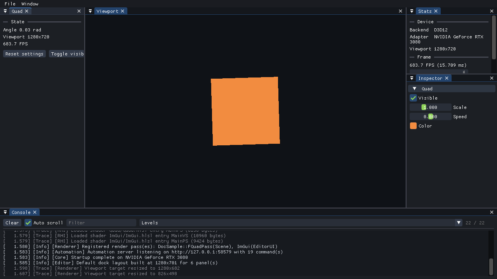

# 自定义面板

面板是编辑器 UI 的单位。本文写一个显示 Pass 状态、提供操作按钮的面板。

## 先确认是否真的需要面板

**简单的可调参数不需要写面板。** 在设置结构上写 `LIME_REFLECT`，Inspector 会自动生成控件：



上图右侧 Inspector 里的复选框、两个滑条、颜色块，全部来自 [02-自定义Pass.md](02-自定义Pass.md) 里那段 `LIME_REFLECT`，一行 UI 代码都没写。左侧的 `Quad` 面板才是本文要写的东西。

需要自己写面板的场景：

- 只读的状态展示（帧数、角度、统计）
- 触发动作的按钮（重置、重新加载、生成）
- 反射表达不了的结构（列表、树、曲线编辑器）
- 需要自定义排版的复合控件

## 内置面板

写之前先看引擎已经提供了什么：

| 面板 | 停靠位置 | 作用 |
| --- | --- | --- |
| `Viewport` | Center | 场景渲染结果 |
| `Console` | Bottom | 日志，可按等级和关键字过滤 |
| `Stats` | Right | 后端、适配器、帧率、视口尺寸 |
| `Inspector` | Right | 全部 Pass 的反射参数 |
| `Project Settings` | Right | 编辑 `ProjectSettings.json`，默认隐藏 |
| `Editor Settings` | Right | 编辑 `EditorSettings.json`（字号、主题、强调色），默认隐藏 |
| `UI Tests` | 浮动 | Test engine 自带窗口，手动运行 UI 测试，默认隐藏 |

**项目面板的名字与内置面板相同时会替换它。** 想换掉默认 Inspector，就写一个 `GetName()` 返回 `"Inspector"` 的面板。

## 第一步：类声明

```cpp
// Source/QuadPanel.h
#pragma once

#include "Editor/Panels/EditorPanel.h"

namespace MyGame
{
	class FQuadPanel final : public Lime::IEditorPanel
	{
	public:
		// 同时作为 ImGui 窗口标题，所以必须跨运行保持稳定 —— 布局持久化依赖它
		const char* GetName() const override { return "Quad"; }

		// 决定默认布局和 Window 菜单里的位置
		Lime::EEditorDockSlot GetDefaultDockSlot() const override { return Lime::EEditorDockSlot::Left; }

		void OnDrawUI(const Lime::FEditorContext& Context) override;
	};
} // namespace MyGame
```

面板直接实现 `IEditorPanel`，没有 CRTP 基类 —— 面板不需要类型标识。

### 可重写的接口

| 方法 | 默认值 | 说明 |
| --- | --- | --- |
| `GetName()` | 无，必须实现 | ImGui 窗口标题，必须稳定 |
| `GetDefaultDockSlot()` | `Right` | `Left` / `Right` / `Bottom` / `Center` |
| `GetMenuCategory()` | `"Panels"` | Window 菜单里的分组 |
| `IsVisibleByDefault()` | `true` | 返回 `false` 则默认隐藏，从菜单打开 |
| `OnDrawUI()` | 无，必须实现 | 每帧调用 |

`Center` 是停靠在场景之上，通常不是你想要的。

> `GetName()` 必须返回**跨运行稳定**的字符串。停靠布局存在 `Saved/EditorLayout.ini` 里，靠窗口标题匹配；改了名字，用户已保存的布局里这个面板就会丢失。

## 第二步：实现

```cpp
// Source/QuadPanel.cpp
#include "QuadPanel.h"

#include "Core/Logging/LogManager.h"
#include "Editor/EditorPanelRegistry.h"

#include "QuadPass.h"

#include <imgui.h>

namespace MyGame
{
	void FQuadPanel::OnDrawUI(const Lime::FEditorContext& Context)
	{
		// GetVisiblePtr() 传给 Begin，标题栏的关闭按钮才能生效
		if (!ImGui::Begin(GetName(), GetVisiblePtr()))
		{
			// 窗口被折叠时 Begin 返回 false，但 End 仍然必须调用
			ImGui::End();
			return;
		}

		// 按类型查找，面板与 Pass 之间没有构造期依赖，任何一方缺失都不会出问题
		FQuadPass* Pass = Context.FindPass<FQuadPass>();
		if (Pass == nullptr)
		{
			ImGui::TextDisabled("Quad pass is not registered");
			ImGui::End();
			return;
		}

		ImGui::SeparatorText("State");
		ImGui::Text("Angle %.2f rad", Pass->GetRotationRadians());
		ImGui::Text("Viewport %ux%u", Context.ViewportWidth, Context.ViewportHeight);
		ImGui::Text("%.1f FPS", Context.FramesPerSecond);

		ImGui::Spacing();
		if (ImGui::Button("Reset settings"))
		{
			Pass->GetSettings() = FQuadSettings{};
			LIME_LOG_INFO(LIME_LOG_CATEGORY_APP, "Quad settings reset");
		}

		ImGui::SameLine();
		if (ImGui::Button("Toggle visibility"))
		{
			Pass->GetSettings().bVisible = !Pass->GetSettings().bVisible;
		}

		ImGui::End();
	}
} // namespace MyGame

// 文件作用域，放在末尾
LIME_REGISTER_EDITOR_PANEL(MyGame::FQuadPanel);
```

三个要点：

**`Begin` 必须配对 `End`。** 窗口被折叠时 `Begin` 返回 `false`，此时**仍然要调用 `End`** —— 漏掉会导致 ImGui 内部状态错乱，表现为其他窗口显示异常。

**`GetVisiblePtr()` 传给 `Begin`。** 这样标题栏的 × 按钮才会真正把面板设为隐藏，并且和 `panel.show` 自动化命令、Window 菜单勾选状态保持同步。

**用 `Context.FindPass<T>()` 拿 Pass，不要存指针。** 这是按类型的运行时查找，面板和 Pass 因此完全解耦 —— 谁先注册无所谓，某一方不存在也只是显示一行提示而不是崩溃。

## 第三步：FEditorContext

面板通过它获取帧状态，不直接碰引擎内部：

| 字段 | 说明 |
| --- | --- |
| `DeltaSeconds` | 帧间隔 |
| `FramesPerSecond` | 帧率 |
| `ViewportWidth` / `ViewportHeight` | 视口尺寸 |
| `BackendName` | `"D3D12"` 或 `"Vulkan"` |
| `AdapterName` | GPU 名称 |
| `LogBuffer` | 日志环形缓冲，Console 面板用 |
| `Renderer` | 渲染器，一般通过 `FindPass<T>()` 间接使用 |
| `FindPass<T>()` | 按类型查 Pass，内部已处理 `Renderer` 为空 |

## 验证

```powershell
./Scripts/Build.ps1
./Projects/MyGame/Binaries/Debug/MyGame.exe
```

面板应该出现在左侧，Window 菜单里也有对应条目。

用自动化确认，不需要点界面：

```powershell
./Scripts/Automation.ps1 shell -Project MyGame
```

```python
>>> engine.list_panels()
[..., {'name': 'Quad', 'visible': True, 'dockSlot': 'Left', 'category': 'Panels'}]
>>> engine.show_panel('Quad', visible=False)      # 隐藏
>>> engine.panel_visible('Quad')
False
>>> engine.reset_layout()                          # 丢弃保存的布局，重建默认布局
```

## 为面板写 UI 测试

上面的 `show_panel` 是直接改可见性标志。它验证不了「Window 菜单里那一项到底连没连对面板」，也验证不了「按钮点下去有没有真的生效」—— 因为它压根没经过菜单和按钮。

UI 测试走的是真实路径：**模拟鼠标去点菜单、去拖滑块**。

```cpp
// Source/QuadUITests.cpp
#include "Core/CoreTypes.h"

// 项目源码是被 glob 进来的，这个文件总会参与构建，所以要自己加守卫。
#if LIME_WITH_IMGUI_TEST_ENGINE

#include "Editor/TestEngine/UITestRegistry.h"

#include <imgui.h>
#include <imgui_test_engine/imgui_te_context.h>

namespace MyGame::UITests
{
	void TestQuadPanelButton(ImGuiTestContext* Ctx)
	{
		// 菜单栏在停靠宿主窗口上。
		Ctx->SetRef("//LimeEditorDockHost");
		Ctx->MenuCheck("Window/Quad");
		Ctx->Yield();

		// 同一停靠槽位的面板是同一节点下的多个 Tab，只有被选中的那个能接收 hover。
		// 少了这一步，控件能被找到却点不动。
		Ctx->WindowFocus("//Quad");

		Ctx->ItemClick("//Quad/Reset");
		Ctx->Yield();

		// Inspector 给每个 Pass 套了 PushID(Pass.get())，用 ** 跳过这个生成的 id。
		IM_CHECK_FLOAT_NEAR_EQ(Ctx->ItemReadAsFloat("//Inspector/**/Speed"), 1.0f, 0.01f);
	}
} // namespace MyGame::UITests

LIME_REGISTER_UI_TEST("MyGame", "quad_panel_button", &MyGame::UITests::TestQuadPanelButton);

#endif
```

跑起来：

```python
>>> status = engine.run_ui_tests(filter="MyGame")
>>> engine.failed_ui_tests(status)
[]
```

**几条容易踩的坑：**

| 现象 | 原因 |
| --- | --- |
| 控件找到了但 hover 失败 | 面板和别的面板同槽位，是未选中的 Tab。加 `WindowFocus` |
| `//Inspector/Triangle` 定位不到 | 折叠头在 `PushID` 作用域内，按标签寻址不到。用 `**` 或干脆不写（默认就是展开的） |
| 路径里带指针地址 | 用 `**` 通配符跳过，别把地址硬编码进去 |

`LIME_REGISTER_UI_TEST` 这个静态宏能在项目里用，是因为项目源码直接编进可执行文件。引擎自己的内置测试用不了它 —— 静态库里只含注册代码的 object 文件会被链接器丢掉，这和自动化命令必须显式注册是同一个原因。

`Window > UI Tests` 可以打开 test engine 自带的窗口，手动挑一个测试跑，肉眼看着它自动操作。默认全速运行，窗口里能调慢。

## 进阶技巧

### 默认隐藏，按需打开

```cpp
bool IsVisibleByDefault() const override { return false; }
```

调试用的面板适合这样，避免默认布局过于拥挤。用户从 Window 菜单打开。

### 菜单分组

```cpp
const char* GetMenuCategory() const override { return "Debug"; }
```

Window 菜单里会多出一个 `Debug` 分组。面板多了以后有用。

### 复用反射控件

如果只想给已有的反射字段换个排版，不必手写控件 —— 用引擎的 `FPropertyDrawer`：

```cpp
#include "Editor/PropertyDrawer.h"

// 在 OnDrawUI 里。返回 true 表示这一帧有值被改动
if (Lime::FPropertyDrawer::Draw(Pass->GetReflectedSettings()))
{
	LIME_LOG_TRACE(LIME_LOG_CATEGORY_APP, "Quad settings changed");
}

// 也可以直接传设置对象，省去 GetReflectedSettings
Lime::FPropertyDrawer::Draw(Pass->GetSettings());
```

这和 Inspector 用的是同一套代码，所以 `Range`、`AsColor`、`ReadOnly` 这些修饰都会被尊重。

### 保持面板轻量

`OnDrawUI` 每帧都调用。避免在里面做文件 IO、分配大块内存、执行重计算 —— 需要的话缓存结果，或者把工作放到 Pass 的 `OnBeginFrame`。

## 常见问题

**面板没出现**
`LIME_REGISTER_EDITOR_PANEL` 漏了，或者不在文件作用域。也检查一下是不是名字和某个内置面板重了，把它替换掉了。

**其他窗口显示异常**
某个 `Begin` 返回 `false` 的分支里漏了 `End`。

**关闭按钮点了没反应**
`Begin` 的第二个参数没传 `GetVisiblePtr()`。

**布局改了但重启后还是旧的**
`Saved/EditorLayout.ini` 保存了用户布局，优先于 `GetDefaultDockSlot()`。删掉该文件，或调用 `panel.resetLayout`。自动化的 `LimeSession` 默认会删除它，正是为了让新增面板可见。

**`FindPass<T>()` 总是返回 nullptr**
Pass 没注册，或者传的类型不对（要传 Pass 类本身，不是设置结构）。

## 下一步

- [04-自动化脚本.md](04-自动化脚本.md) —— 用脚本验证 UI 与渲染
- [05-自动化能力参考.md](05-自动化能力参考.md) —— 全部命令速查
